# getx-snippets
[](https://github.com/kauemurakami/get_snippets_extension) 
<a href="https://www.buymeacoffee.com/kauemurakami" target="_blank"></a>

 

Extension made for you, who also uses this powerful library and doesn't like to waste time.  
To that extent, you find snippets of snippets of code, or even entire classes, generated with just a few keystrokes, 
it's quick and easy.  
We came to make your development with [Get](https://pub.dev/packages/get) easy !!!    
So get out front and start using, it's just 35 snippets, with fully intuitive prefixes, so you don't forget :D  
> The extension was made so that we can start a complete functional project without any necessary changes.

#### download extension on [MarketPlace](https://marketplace.visualstudio.com/items?itemName=get-snippets.get-snippets)
#### If you are with us until now or just arrived, you will also like this documentation that I have prepared with love to help you :heart: use GetX in an easy and intuitive way! know [getx_pattern](https://kauemurakami.github.io/getx_pattern/)  
## Requirements
```
vscode ^1.43.0
dependencies:
  flutter:
    sdk: flutter
  get: ^3.2.0 ou >
  meta: ^1.1.8
  http: ^0.12.1 or dio: 3.x
```
## Comments
**implementation**
>Import errors can appear until all files are created. 
>When all files are created, just import all dependencies to resolve all errors.  

**Proposed structure -> subsequent changes will not change the current structure**
```yaml
- /app  
    - /data
        - /repository
          - my_repository.dart
        - /model
          - my_model.dart
        - /provider
          - my_provider.dart
    - /modules
        - /my_module
            - my_page.dart
            - my_controller.dart
            - my_binding.dart
            - /widgets
              - reusable_module_widget.dart
    - /widgets 
      - reusable_global_widget.dart
    - /routes
        - my_routes.dart
        - my_pages.dart
    - /theme
        - text_theme.dart  
        - color_theme.dart  
        - app_theme.dart  
- main.dart  
# proposed by william Silva 

examples available in this repository:  
```
[getx_pattern_site and getx_example](https://github.com/kauemurakami/getx_pattern/)

### [Understand more about this structure and much more in our proposed pattern](https://kauemurakami.github.io/getx_pattern/)

## Example
[See complet exemple](https://github.com/kauemurakami/getx_snippets_extension/tree/master/examples)  
not yet available
## Features
- [Classes](#classes)  
  Here you will find snippets that generate incredible complete classes quickly and easily.  
- [Functions and Variables](#functions-and-variables)  
  Here you will find snippets that will help you to create various types of variables and functions quickly and easily.  
- [Widgets](#widgets)  
  Here you will find snippets that will help you create widgets quickly and easily.  
- [Widgets Component](#widgets-components)  
  Here you will find reusable widgets, made in a stateless widgets ready to be consumed by several widgets.  

## Wrap


## Classes
### getmain
Quickly rewrite your file **main.dart**  
**getmain** snippet will bring you the complete class, you just need to set your **home**  
**Using:** In your main class, delete **all** the content and start writing **getmain**,  
wait for the snippet and that's it !


### getmodel
Create classes for your objects quickly and easily.    
**getmodel** snippet a complete model will return, with the functions fromJson and toJson.   
**Using:** In an empty file, start writing **getmodel**,  
Wait for the snippet, name your class and you're done

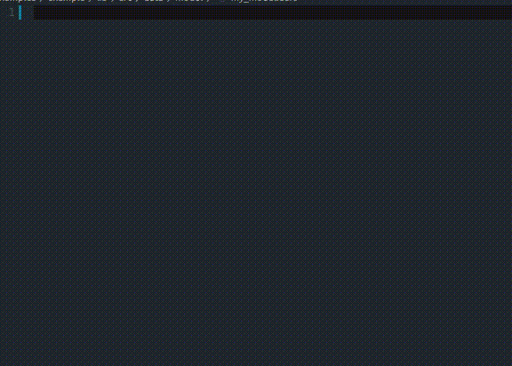

### getrxmodel
Create classes observable along with a dart class for your objects quickly and easily.    
**getrxmodel** snippet a complete model will return, with the functions fromJson and toJson.   
**Using:** In an empty file, start writing **getrxmodel**,  
Wait for the snippet, name your class and you're done


### getpage
Quickly create, Stateless classes with widget and reactive features provided by [Get](https://pub.dev/packages/get), GetX,  
**getpage** snippet, will bring you a complete stateless class, you only need to indicate:  
- The name of your Page;  
- The name of your Repository;  
- The widget **parent** of **GetX**.
- The name of your Controller,
- The widget child of **GetX**.  
**Using:** When creating a file ***my_page.dart*** empty, you can start by writing **getpage**,  
wait for the snippet, define the necessary data and ready!!  
>> **IMPORTANT TIP:** To take full advantage of using this extension, when generating classes with more than one attribute to be defined, you can define them sequentially, every full word press **TAB** to go to the next expected attribute, many snippets do that.


### getpagesroutes
Quickly create, a class to manage your Routes with [Get](https://pub.dev/packages/get)  
**getroutepages** snippet, will bring you a complete Route class, you just need to add more routes.  
**Using:** When creating a file ***app_pages.dart*** empty, you can start by writing **getpagesroutes**,  
wait for the snippet and that's it !  
We decided to separate your routes from their ** getpage ** functions through a ** part and part of ** so that your file is smaller and can make it easier to refactor your project, changing your routepage only in its ** app_routes file constant. dart **


### getpageroute
Now that you have the routes class, easily add another route with navigation [Get](https://pub.dev/packages/get)  
**getpageroute** snippet, will bring you complete route, you will only define the url and your page in an easy way.  
**Using:** Inside the file ***app_pages.dart***, in our class created with *getpagesroutes*, you can start by writing **getpageroute** for adding new route page !  
wait for the snippet and that's it !

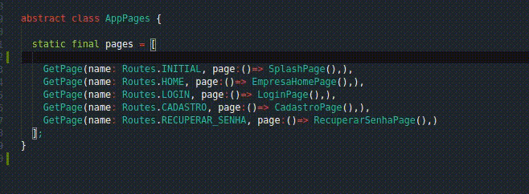

### getroutes
Now that you have our App Pages class in our **app_pages.dart** file, let's create a new file at the same level, within the routes folder.  
Give it the name **app_routes**, it will only be responsible for saving your routes in constants, this will facilitate the **location** of your routes and you can exchange all the flames of a **single** route just by changing the value of your constant for that. So come on.  
with the **app_routes.dart** file created, start typing **getroutes**.  
This will return us a small abstract class with its constants and some example routes :D 


### getroute
Now that you have the routes class, easily add another route with navigation [Get](https://pub.dev/packages/get)  
**getroute** snippet, will bring you complete route, you will only define the url and your page in an easy way.  
**Using:** Inside the file ***app_routes.dart***, in our class created with *getroutes*, you can start by writing **getroute**,  
wait for the snippet and that's it !

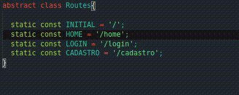


### getcontroller
Quickly create Controller classes with RxController from [Get](https://pub.dev/packages/get).  
**getcontroller** snippet, will bring you a complete Controller class.  
**Using:** When creating a new file ***my_controller.dart*** empty, start writing **getcontroller**,  
wait for the snippet, set the data and you're done!


Or, for a **simple controller**, **getcontrollervoid**.

### getrepository
Quickly create Repository classes for your entities.  
**getrepository** snippet, will bring you a complete Repository class, including an example of a complete crud that complements itself when you generate the provider with *getprovider*.  
**Using:** When creating a new file ***my_repository.dart*** empty, start writing **getrepository**,  
wait for the snippet, set the data and you're done !


### getprovider
Quickly create Provider classes, to provide data to your application, either via API or local database.  
**getprovider** snippet, will bring you a Provider class, including examples of a complete crud that can be consumed by the functions generated in the com *getrepository*.  
**Using:** When creating a new file ***my_provider.dart*** empty, start writing **getprovider**,  
wait for the snippet, set the data and you're done !


### getproviderdio
Has the same purpose as getprovider, but for people who use Dio instead of http.

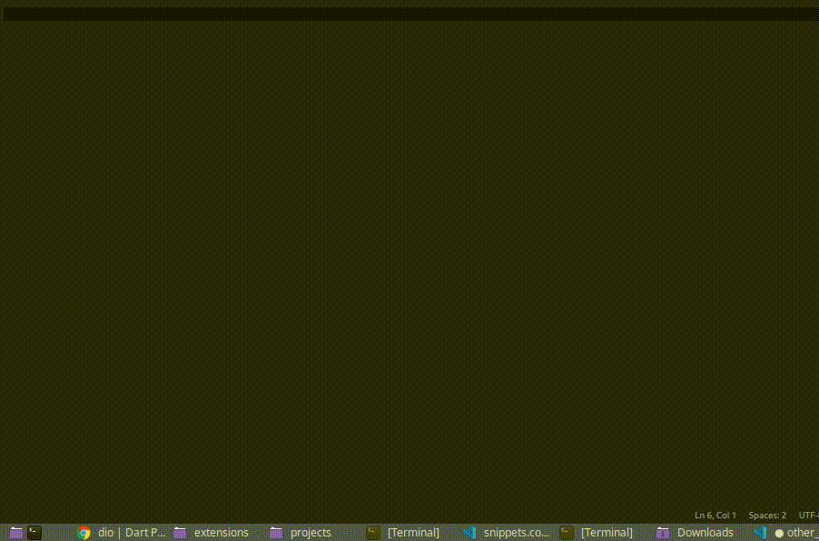

### gettheme

This snippet will bring you a final ThemeData, where you can customize the entire theme of your application, such as texts, buttons, colors and more.   
Start typing gettheme, wait for the snippet and go!


## Functions and variables
### getfinal and getfinal_
Quickly create variables **final observável** for [Get](https://pub.dev/packages/get).  
**getfinal** snippet, will bring you an observable final variable and its methods **get** and **set**.  
**Using:** In any file that has the package [Get](https://pub.dev/packages/get), just start writing **getfinal**,  
wait for the snippet, choice between private or not, set the variable name and you're done !

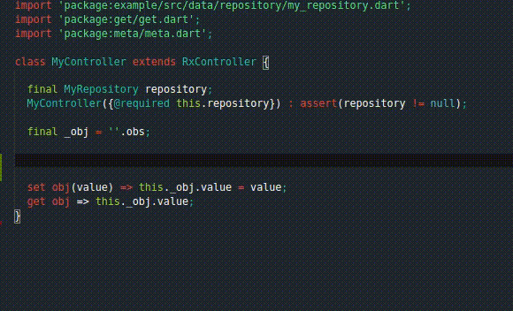

### getset and getset_
Quickly create a function **set** for an observable [Get](https://pub.dev/packages/get).  
**getset** snippet, will bring you a function to assign a value in your observable.  
**Using:** In any file that has the package [Get](https://pub.dev/packages/get), just start writing **getset**,  
wait for the snippet, choice between private or not, set the variable name and you're done !


### getget and getget_
Quickly create a function **get** para um observável [Get](https://pub.dev/packages/get).  
**getget** snippet, will bring you a function to recover the value of your observable.  
**Using:** In any file that has the package [Get](https://pub.dev/packages/get), just start writing **getget**,  
wait for the snippet, choice between private or not ,set the variable name and you're done !


### getwidget
Quickly instantiate your custom widgets.    
**getwidget** It only serves for you to retrieve a custom widget in a practical way.  
**Using:** In any file that has the material, just start writing **getwidget**,  
wait for the snippet, set the widget name and you're done !

### getx
A simple getx Widget with shortcuts for controller name will return**getx**.  
It only serves for you to retrieve a custom widget in a practical way.  
**Using:** In any file that has the material, just start writing **getx**,  
wait for the snippet, set the widget name and you're done !

### getargs
Quickly retrieve items sent from other locations.    
**getargs** 
it will simply return a GetX object, Get.arguments, if you have sent any value through it, otherwise it will be empty or null.  
**Using:** In any empty file that imports Get, start typing **getargs**,  
wait for the snippet, seven the parameter name or retrieve all the arguments and and you're done !
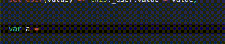

## Widgets
### getlist
Quickly create a widget **GetX** from [Get](https://pub.dev/packages/get) containing a functional dynamic list, consuming your controller .  
**getlist** this snippet will bring you the [Get](https://pub.dev/packages/get) widget, GetX, along with
some optional attributes and its builder function, which in turn contains a listview.separated with a child listtile to display values.  
**Using:** In any file that has the package [Get](https://pub.dev/packages/get), just start writing **getlist**,  
wait for the snippet, set the variable name and you're done !  
> Notice that in the example we are using ***initState*** to enter a value for our variable. 
>We did this so that you can see that a statefull widget is not necessary when using ***Get***, you could start your page by calling >a ***controller function*** that retrieves all your users and inserting them into a ***variable in your controller***, for example, then just use >the same controller your controller inside the GetX widget.

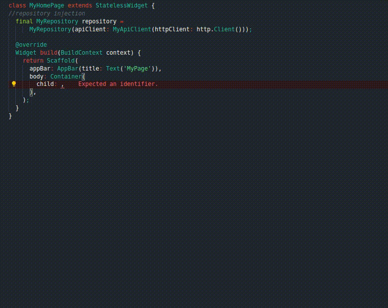
### result
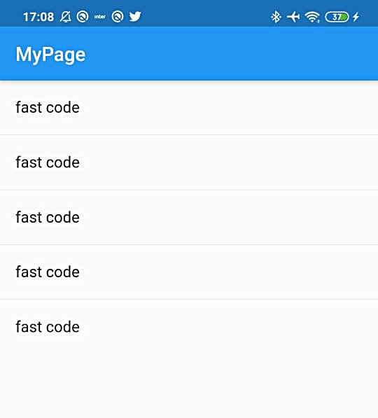

### getlistdismissible
Quickly create a GetX widget from [Get](https://pub.dev/packages/get) containing a fully configured listview and dismissible widgets.  
**getlistdismissible** it will bring you, a GetX Widget, a ListView containing a Dismissible ready to use, you can drag from beginning to end to edit or from end to beginning to delete, just create your functions in the controller.  
**Using:** In any widget that has the Get package, start writing **getlistdismissible**,  
wait for the snippet, set the variable and function name and you're done !  

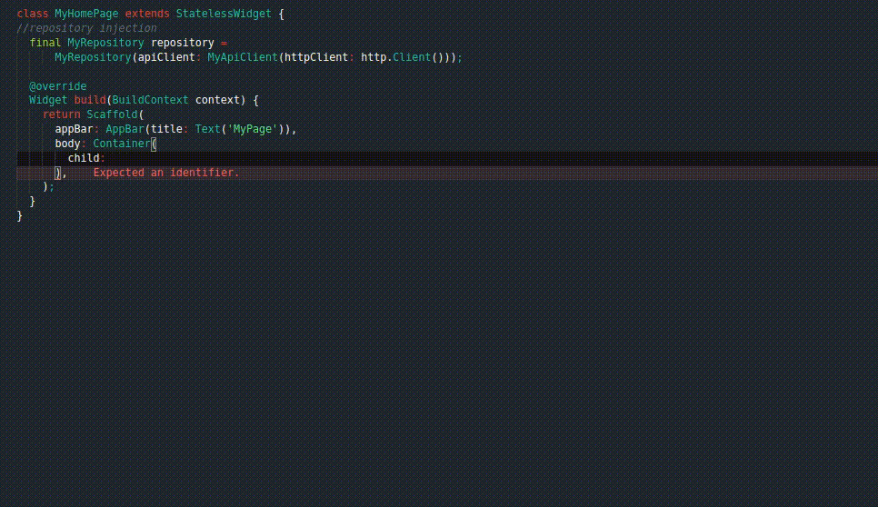
### result


### getfab
Quickly create a FloatingActionButton widget.  
**getfab** A simple FloatingActionButton will return.  
**Using:** In any file that contains the material, start writing **getfab**,  
wait for the snippet, set the variable and function and you're done !  

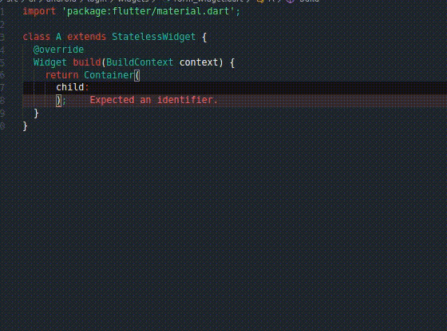

### getbutton
Quickly create a RaisedButton widget.  
**getbutton** A simple RaisedButton will return.  
**Using:** In any file that contains the material, start writing **getbutton**,  
wait for the snippet, set the variable and function and you're done !  

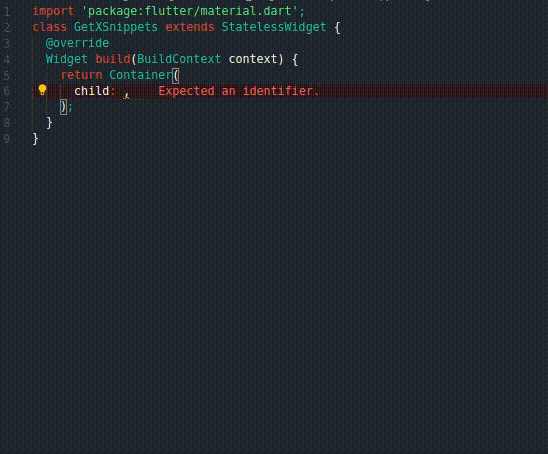

## Widgets Components
he widgets component snippets were created thinking about those, who like me, like reusable componentizat widgets.
They will bring you a complete widget with input values, so you can use it at different times

### getformwidget
<pre>
dependencies:
  validators: ^2.0.0
</pre>
Quickly create a GetX widget from [Get](https://pub.dev/packages/get) containing a fully customized form widget.  
**getformwidget** You will be returned with a GetX Widget containing a functional form.  
**Using:** In any widget that has the Get package and material/cupertino, start writing **getformwidget**,  
Wait for the snippet, and that's it, now just use this widget component in the view you want, and you can customize it or not !
>**Note** that we are not initializing our controller in the example. This is because we are assuming that you are calling this form in a "login" class, where we start it.
>This is because the view that is consuming this widget has the same controller, this was possible because we used 'asignId: true' in our GetX widget 

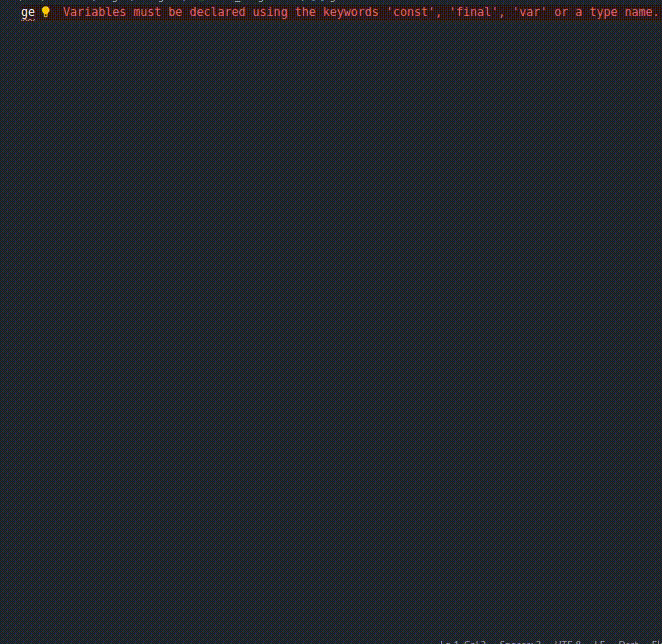

### getbuttonwidget
Create a reusable button quickly and easily. and dismissible widgets.  
**getbuttonwidget** You will be returned with a button that can be reused in different locations, so we set parameters to facilitate customizing taking into account the context it is inserted in.  
**Using:** In any widget that has the material, start writing **getbuttonwidget**,  
wait for the snippet, and ready, now just use it wherever you want !  


### getfabwidget
Create a reusable button quickly and easily. and dismissible widgets.  
**getfabwidget** You will be returned with a fab button that can be reused in different locations, so we set parameters to facilitate customizing taking into account the context it is inserted in.  
**Using:** In any widget that has the Get package, start writing **getfabwidget**,  
wait for the snippet, set the variable and function name and you're done !  


### More awesome Snippets
getService
getBinding  
getPut  
getFind  
getLazyPut  
getSnackbar  
getDefaultDialog  
getDialog  
getBottomSheet  
getonInit  
getonClose  
getToNamed  
getOffNamed  
getOffAllNamed  
getTo  
getOff  
getOffAll  
getStorage  
getStorageWrite  
getStorageRead  

**Enjoy!**

-----------------------------------------------------------------------------------------------------------