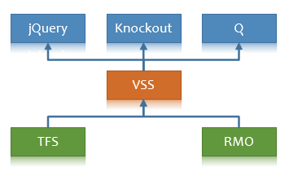

# Visual Studio Services Web Extension SDK

## Overview

Client SDK and TypeScript declare files for developing [Visual Studio Team Services Extensions](https://www.visualstudio.com/integrate/extensions/overview).

The core SDK script, `VSS.SDK.js`, enables web extensions to communicate to the host Team Services frame and to perform operations like initializing, notifying extension is loaded or getting context about the current page.

> A previous version of the SDK was named `vss-sdk`. Make sure to switch to the new `vss-web-extension-sdk` name.

## Get the SDK

1. Download and install [Node.js]((https://nodejs.org/en/download/))
2. Run `npm install vss-web-extension-sdk` from the root of your extension project

This will place `VSS.SDK.js` and `VSS.SDK.min.js` in `node_modules/vss-web-extension-sdk/lib/`

### Include the SDK script on your page

If you are developing a web extension, you will need to reference the SDK script from your HTML pages. For example:

```html
<script src="lib/VSS.SDK.min.js"></script>
```

To ensure the SDK script is packaged with your extension, update your extension manifest (typically `vss-extension.json`) and add a new entry to `files`:

```json
{       
	"files": [{
		"path": "node_modules/vss-web-extension-sdk/lib",
		"addressable": true,
		"packagePath": "lib"
	}]
}
```

Note: setting `packagePath` is optional, but results in a simpler path for referencing the SDK script from your HTML pages. Not setting a part name would have required you to reference the full path in your `<script>` tag (`src="node_modules/vss-web-extension-sdk/lib/VSS.SDK.min.js"`)


## Use the SDK 

From your web extension's HTML page, include and initialize the VSS SDK like this:

```html
<script>

  // Initialize
  VSS.init({
    usePlatformScripts: true, 
    usePlatformStyles: true
  });

  // Register callback to get called when initial handshake completed
  VSS.ready(function() {
    // Start using VSS
  });

</script>
  ```
      
Full API reference of VSS.SDK.js can be found at [Core Client SDK](https://www.visualstudio.com/docs/integrate/extensions/reference/client/core-sdk) page.

## Types

Type definitions are provided for:

 * UI controls and client services (see `typings/vss.d.ts`)
 * REST clients and contracts for Build, Work, and Code (see `typings/tfs.d.ts`)
 * REST clients and contracts for Release Management (see `typings/rmo.d.ts`)

Dependency graph:


 
### Consuming the types

From a [TypeScript](https://www.typescriptlang.org) 2.5 or later project:

* Set `"moduleResolution": "node"` in your `tsconfig.json` project file

See [TypeScript Module Resolution](https://www.typescriptlang.org/docs/handbook/module-resolution.html) for more details.

Alternatively, you can explicitly reference the types at the top of your TypeScript file(s):

```ts
    /// <reference types="vss-web-extension-sdk" />
```

## Organizing your web extension project

If you are developing a web extension for Visual Studio Team Service using TypeScript, we recommend the following organization:

### Project structure

```
 |-- src
     |-- app.ts
     |-- some-module
         |-- a.ts
         |-- b.ts
 |-- static
     |-- css
         |-- main.css
     |-- images
         |-- logo.png
     |-- app.html
 |-- vss-extension.json
 |-- package.json
 |-- tsconfig.json
``` 

1. Place TypeScript source files in `src`
2. Place static content (CSS, images, HTML, etc) in `static`
   * This simplifes the process of packaging all necessary static content in your

### TypeScript project file (`tsconfig.json`)

Defines the options for compiling your TypeScript files.

```json
{
    "compilerOptions": {
        "module": "amd",
        "moduleResolution": "node",
        "target": "es5",
        "rootDir": "src/",
        "outDir": "dist/",
        "types": [
            "vss-web-extension-sdk"
        ]	
    }
}
```

1. After compiling (`tsc -p .`), resulting .js files are placed in `dist`. For example, `dist/app.js`.

2. If your code directly uses types from other @types modules, you will want to include the module(s) in your package.json and add them to the `types` array. See [@types](http://www.typescriptlang.org/docs/handbook/tsconfig-json.html).

Learn more about [tsconfig.json](http://www.typescriptlang.org/docs/handbook/tsconfig-json.html)

### NPM package manifest (`package.json`)

Declares the libraries (like the vss-web-extension-sdk) required to compile, package, and use your extension.

```js
{
  /* other details like ID, version, etc are omitted */
  
  "scripts": {
    "build": "tsc -p .",
    "postbuild": "npm run package",
    "package": "tfx extension create",
    "gallery-publish": "tfx extension publish --rev-version",
    "clean": "rimraf ./dist && rimraf ./*.vsix"
  },
  "devDependencies": {
    "rimraf": "^2.5.4",
    "tfx-cli": "^0.3.45",
    "typescript": "^2.1.4"
  },
  "dependencies": {
    "@types/jquery": "^2.0.34",
    "@types/q": "0.0.32",
    "vss-web-extension-sdk": "^5.127.0"
  }
}
```

1. `scripts` provides a convenient way to define common operations that you want to perform on your project, like compiling and packaging. 
   * For example, to build (compile) and package your extension, run: `npm run build`. This runs `build` and `postbuild`. If you make a change that doesn't require compiling, you can package by simply running `npm run package`.
   * To package and publish directly to the Marketplace on build, change the `postbuild` script to run the `gallery-publish` script (instead of `package`). You can then run `npm run build -- --token xxxxxx` (where xxxx is you personal access token for publishing to the Marketplace) to build, package, and publish your extension.
   
2. The dependencies on the @types for `jquery` and `q` are only necessary if your TypeScript code is directly referencing either of these types.

Learn more about [package.json](https://docs.npmjs.com/files/package.json)

### Extension manifest (`vss-extension.json`)

```js
{
    /* details omitted */
    "files": [
        {
            "path": "dist",
            "addressable": true
        },
        {
            "path": "static",
            "addressable": true
        },
        {
            "path": "node_modules/vss-web-extension-sdk/lib",
            "addressable": true,
            "packagePath": "lib"
        }
    ],
    "contributions": [
        {
            "id": "my-hub",
            "type": "ms.vss-web.hub",
            "properties": {
                "name": "Hub",
                "uri": "static/app.html"
            }
        }
    ]
}
```

1. The compiled JavaScript files (placed into `dist` by your `tsconfig.json`) will be packaged into the `dist` folder of the extension package.

2. The VSS SDK scripts will be packaged into the `lib` folder of the extension package.

Learn more about the [extension manifest](https://www.visualstudio.com/docs/integrate/extensions/develop/manifest).

### HTML page

```html
<head>
   <script src="../lib/VSS.SDK.min.js"></script>
   <!-- 
        Alternatively, if the packagePath attribute is not set for this file in your extension manifest (see above), do this:
         <script src="../node_modules/vss-web-extension-sdk/lib/VSS.SDK.min.js"></script>
   -->
</head>

<body>

 <script type="text/javascript">

  // Initialize the VSS sdk
  VSS.init({
      usePlatformScripts: true,
      usePlatformStyles: true
  });

  VSS.require(["dist/app"], function (app) { 
      ...
  });

 </script>

</body>
```

## Code of Conduct

This project has adopted the [Microsoft Open Source Code of Conduct](https://opensource.microsoft.com/codeofconduct/). For more information see the [Code of Conduct FAQ](https://opensource.microsoft.com/codeofconduct/faq/) or contact [opencode@microsoft.com](mailto:opencode@microsoft.com) with any additional questions or comments.
